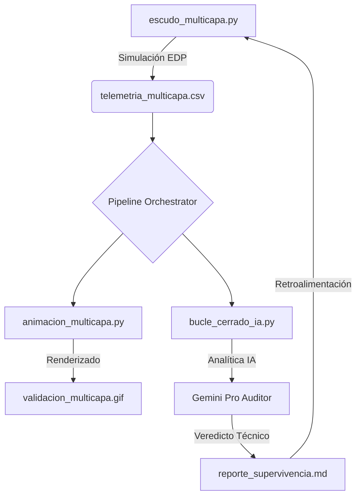

# 🛰️ ReentryFlow: SciML Digital Twin para Escudos Térmicos Multicapa

[](https://www.python.org/downloads/)
[](https://opensource.org/licenses/MIT)
[]()
[]()

Sistema de simulación de alta fidelidad y pipeline de **DataOps** para el análisis transitorio de la difusión de calor en escudos de protección térmica (TPS). Este Digital Twin permite predecir fallos críticos y optimizar materiales antes de la fabricación.

## 📊 Visualización de Ingeniería

### Perfil Térmico 1D (Estela Dinámica y Monitoreo HUD)
Animación suavizada mediante splines que muestra la penetración del calor. La capa exterior ablativa disipa energía mientras que el aislante protege el núcleo.
<p align="center">
  
</p>

### Mapa de Calor Termográfico 2D
Simulación de campo bidimensional con isotermas dinámicas para análisis de efectos de borde y distribución lateral de temperatura.
<p align="center">
  
</p>

### Gestión de Riesgos y Optimización
| Optimización de Diseño | Cuantificación de Incertidumbre |
| :---: | :---: |
|  |  |
| *Búsqueda del espesor mínimo seguro.* | *Análisis estocástico de Monte Carlo (100 runs).* |

---

## 🔬 Física y Matemática

### Ecuación Diferencial Parcial (EDP)
$$\frac{\partial T}{\partial t} = \alpha(x, T) \nabla^2 T$$

Donde $\alpha(x, T)$ es la difusividad térmica, que en este modelo es tanto **espacialmente heterogénea** (multicapa) como **térmicamente no lineal** (variable con $T$ en el motor avanzado).

### Esquema Numérico
Se utiliza el método **FTCS (Forward-Time Central-Space)** con un paso de tiempo $\Delta t$ controlado por el criterio de estabilidad de Courant:
$$r = \frac{\alpha_{max} \Delta t}{\Delta x^2} \le 0.45$$

---

## 🏗️ Flujo de Operaciones (DataOps)



---

## 🚀 Ejecución

### Orquestador Avanzado (`pipeline_reentrada.sh`)
El script de Bash v2.0 automatiza todo el flujo con manejo de errores y limpieza selectiva:

```bash
# Ejecución estándar (Simulación + Animación + Auditoría IA)
./pipeline_reentrada.sh

# Limpieza de datos antiguos y salto de IA
./pipeline_reentrada.sh --clean --skip-ia
```

### Requisitos
```bash
pip install matplotlib numpy pillow scipy
```

---

## 📂 Estructura del Proyecto
*   `escudo_multicapa.py`: Motor físico 1D.
*   `escudo_2d.py`: Motor físico 2D para análisis de campo.
*   `escudo_avanzado.py`: Física de radiación y $\alpha(T)$ no lineal.
*   `sensitivity_study.py`: Algoritmo de optimización de diseño.
*   `monte_carlo_analysis.py`: Cuantificación de incertidumbre.
*   `animacion_*.py`: Generadores de visualización profesional.
*   `bucle_cerrado_ia.py`: Optimizador autónomo guiado por IA.
