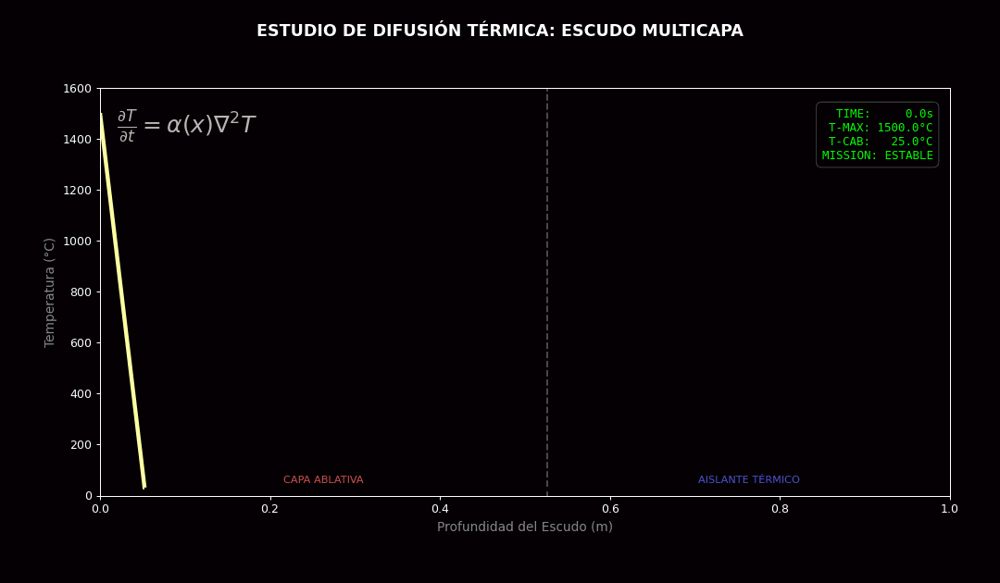
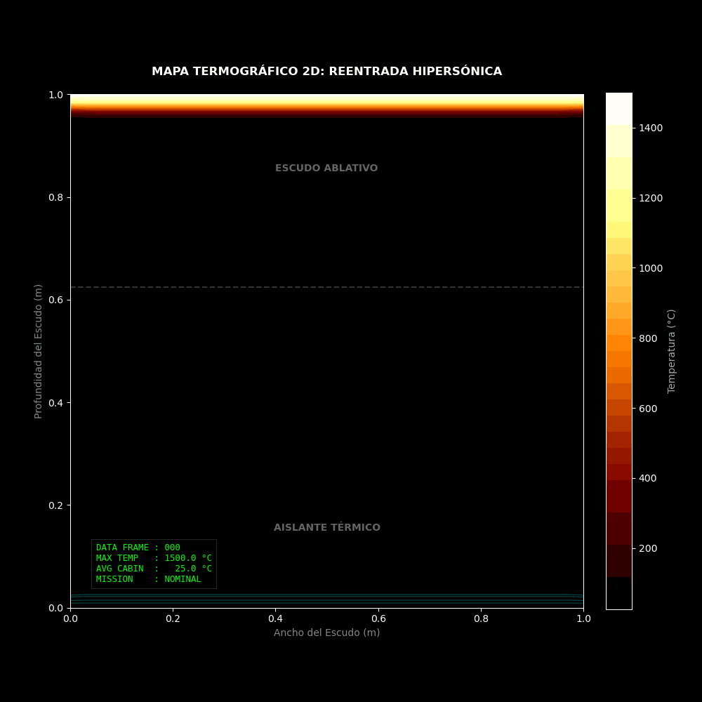
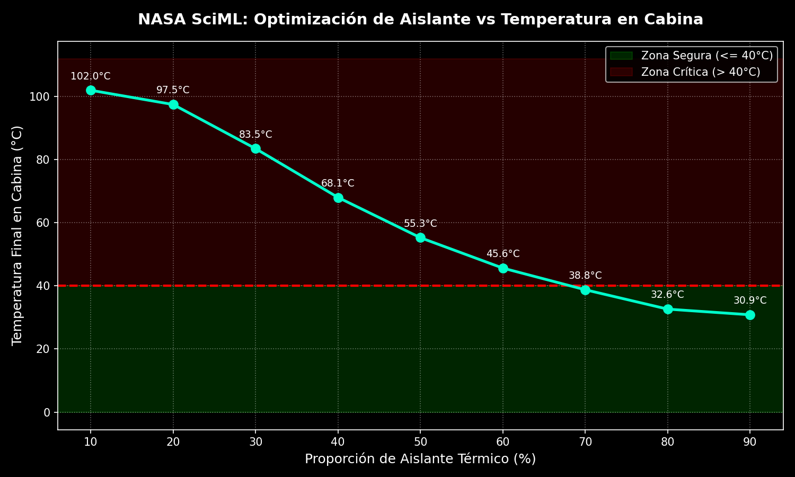
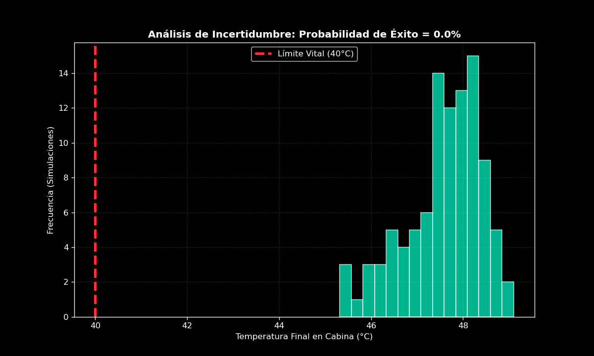
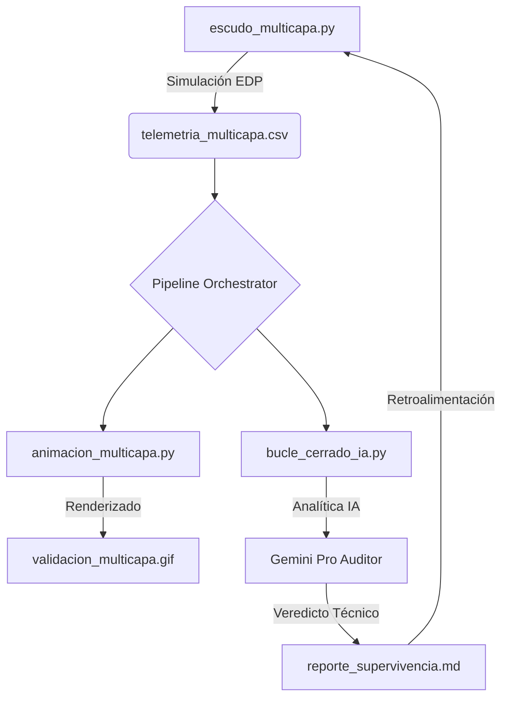

# 🛰️ ReentryFlow: SciML Digital Twin para Escudos Térmicos Multicapa

[](https://www.python.org/downloads/)
[](https://opensource.org/licenses/MIT)
[]()

Sistema de simulación de alta fidelidad y pipeline de **DataOps** para el análisis transitorio de la difusión de calor en escudos de protección térmica (TPS) durante la reentrada atmosférica hipersónica.

## 📊 Visualización Termodinámica

### Perfil Térmico 1D (Estela Dinámica y Monitoreo HUD)
El modelo evalúa la propagación del plasma a través del escudo térmico multicapa. La capa exterior (ablativa) conduce el calor rápidamente, mientras que el núcleo (aislante) bloquea el flujo térmico.
<p align="center">
  
</p>

### Mapa de Calor Termográfico 2D
Expansión bidimensional del modelo térmico, permitiendo simular cómo se propaga la onda de calor lateral y transversalmente a lo largo del fuselaje de la cápsula.
<p align="center">
  
</p>

### Estudio de Sensibilidad Paramétrica
El optimizador de DataOps barrió el espacio de diseño (proporción Aislante vs Ablativo) para determinar empíricamente qué porcentaje mínimo de material aislante es necesario para evitar que la temperatura de la cabina exceda los 40°C (Límite Vital).
<p align="center">
  
</p>

---

## 🔬 Física y Matemática del Modelo

El núcleo del motor físico resuelve la **Ecuación del Calor Parcial Unidimensional** con difusividad térmica espacialmente heterogénea $\alpha(x)$.

### Ecuación Diferencial Parcial (EDP)
$$\frac{\partial T}{\partial t} = \alpha(x) \nabla^2 T$$

Donde:
*   $T$: Temperatura en función del tiempo ($t$) y la posición ($x$).
*   $\alpha(x)$: Difusividad térmica local del material ($m^2/s$).

### Discretización Numérica (Esquema FTCS)
Para la integración temporal, implementamos el método **Forward-Time Central-Space (FTCS)**, transformando la EDP en un algoritmo iterativo explícito:

$$T_{i}^{n+1} = T_{i}^{n} + \frac{\alpha_i \Delta t}{\Delta x^2} (T_{i+1}^{n} - 2T_{i}^{n} + T_{i-1}^{n})$$

### Criterio de Estabilidad (CFL)
El paso de tiempo $\Delta t$ se calcula dinámicamente basándose en el **Número de Courant ($r$)** máximo permitido para el material de mayor conductividad:

$$r = \frac{\alpha_{max} \Delta t}{\Delta x^2} \le 0.45$$

---

## 🛡️ Arquitectura del Escudo (Dual-Zone)

1.  **Capa Ablativa Exterior:** Diseñada para disipar la energía cinética inicial.
    *   $\alpha = 0.005 \, m^2/s$ (Alta conductividad transitoria).
2.  **Aislante Térmico Avanzado:** Núcleo de protección de la cabina.
    *   $\alpha = 0.0005 \, m^2/s$ (Baja difusividad para bloqueo térmico).

### 🎲 Cuantificación de Incertidumbre (Monte Carlo)
En entornos aeroespaciales reales, las propiedades de los materiales tienen variaciones estadísticas. El sistema incluye un módulo de simulación estocástica que ejecuta cientos de misiones variando aleatoriamente la difusividad térmica ($\alpha$) para calcular la probabilidad de supervivencia.
<p align="center">
  
</p>

---

## 🏗️ Flujo de Operaciones (SciML & DataOps)



El proyecto está orquestado por un pipeline de automatización robusto:

1.  **Motores Físicos (`solver.py`, `escudo_2d.py`):** Motores de cálculo vectorizados en Python puro/NumPy que resuelven la EDP en el espacio-tiempo.
2.  **DataOps Optimization (`sensitivity_study.py`):** Automatiza corridas masivas variando la arquitectura del TPS y generando la curva de viabilidad térmica.
3.  **Auditoría Inteligente (Closed-Loop AI):** El script `bucle_cerrado_ia.py` usa Gemini para supervisar y proponer re-diseños automáticos en base a la supervivencia de los astronautas.
4.  **Generadores Visuales (`animacion_*.py`):** Exportan GIFs optimizados en memoria, renderizando isoclinas, HUDs y contornos en tiempo real.

---

## 🚀 Ejecución en Linux

Asegúrate de tener instaladas las dependencias:
```bash
pip install matplotlib numpy pillow scipy
```

Ejecuta el pipeline orquestador base:
```bash
chmod +x pipeline_reentrada.sh
./pipeline_reentrada.sh
```

*(O de forma independiente: ejecuta los simuladores de física, seguidos de sus respectivos scripts de visualización, o lanza directamente los bucles de IA/DataOps `python3 sensitivity_study.py`).*
